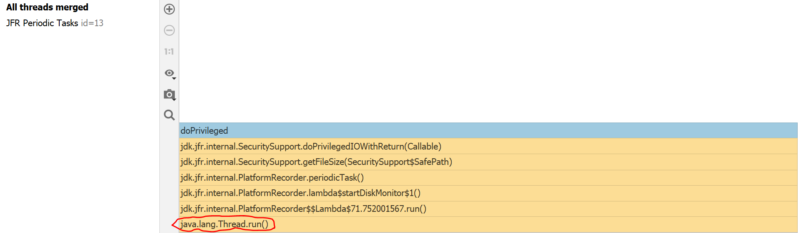
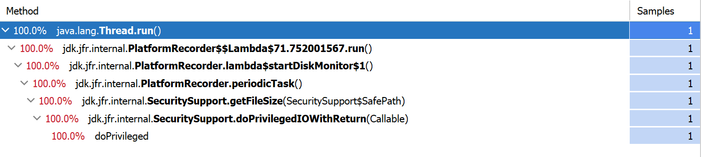
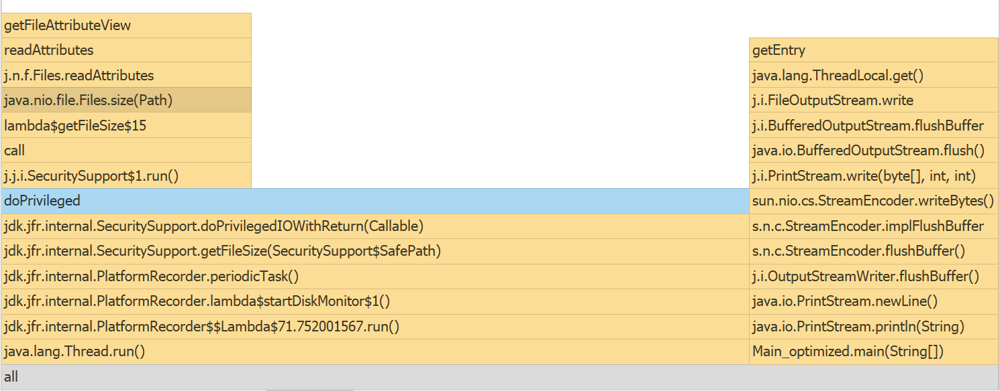
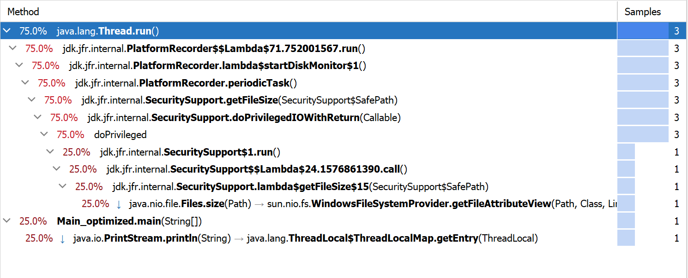

# OS_Lab6

Source code in Java:
```Java
    static boolean func1() {
        for(int i = 0; i < 100000000; i++) {
            try {
                Thread.sleep(10000000);
            } catch (InterruptedException e) {
                e.printStackTrace();
            }
        }
        return true;
    }

    static boolean func2(int a) {
        for(int i = 0; i < 10; i++) {
            try {
                Thread.sleep(1);
            } catch (InterruptedException e) {
                e.printStackTrace();
            }
            if(i > a)
                return true;
        }
        return false;
    }

    public static void main(String[] args) {
        long start = System.nanoTime();
        System.out.println("\n Inside main()\n");
        String typeOfShape;
        typeOfShape = new Scanner(System.in).nextLine();

        int i = 0;

        for(; i<10;i++); {
            for(int j=1000000; j > 0; j--) {
                if(func1() || func2(i)) {
                    System.out.println("\n Inside if()\n");
                }
            }
        }
        long end = System.nanoTime();
        System.out.println("Program execution time - " + (double) (end - start) / Math.pow(10, 9) +
                " (before optimization)");
    }
```
Results of profiling of this program:




Profiling results show that 100% of execution time is spent on Thread.run() process, aka Thread.sleep().

Next changes were inplemented:

> reducing sleep() impact

Optimized program:

```Java
    static boolean func1() {
        for(int i = 0; i < 100000000; i++) {
            
        }
        return true;
    }

    static boolean func2(int a) {
        for(int i = 0; i < 10; i++) {
            if(i > a)
                return true;
        }
        return false;
    }

    public static void main(String[] args) {
        long start = System.nanoTime();
        System.out.println("\n Inside main()\n");
        String typeOfShape;
        typeOfShape = new Scanner(System.in).nextLine();
        int i = 0;
        for(; i<10;i++); {
            for(int j=1000000; j > 0; j--) {
                if(func1() || func2(i)) {
                    System.out.println("\n Inside if()\n");
                }
            }
        }
        long end = System.nanoTime();
        System.out.println("Program execution time - " + (double) (end - start) / Math.pow(10, 9) +
                " (before optimization)");
    }
```

Optimization result:




Thus program executes much more tasks and Thread.run() execution time was reduced to **75%.**
